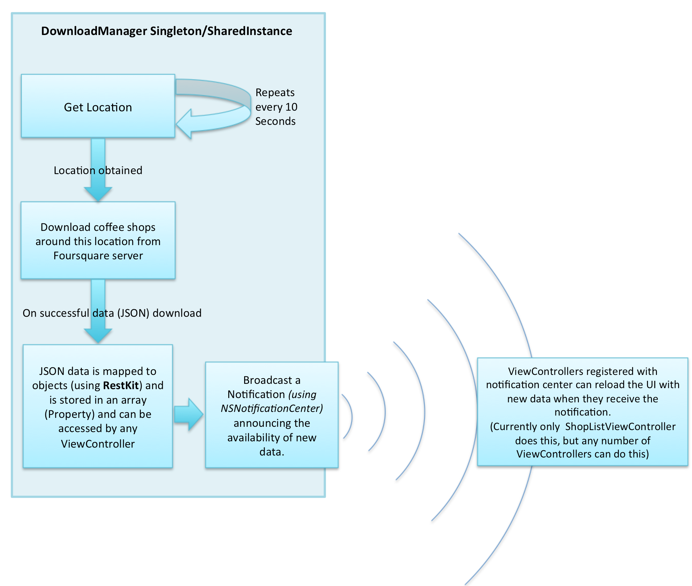

# CoffeeShop

NimyJ_CoffeeApp application displays the nearest coffee shops around the iOS device as a list view, this list will be refreshed approximately every 10 seconds. The user can tap on any row to view the details of that particular coffee shop.

The detail view displays the following:

1. The Name of the shop and distance to the shop from device
1. Address
1. A Map View showing the coffee shop
1. Button to view the coffee shop in the Map application
1. Phone number and a Button to dial the number
1. The coffee shop's website, tapping on this will open the website in web browser'

## Installation

1. Download the project 
2. Run 'pod install' in terminal after navigating to the folder containing podfile (this will install RestKit)
2. Open 'NimyJ_CoffeeApp.xcworkspace' in Xcode  (NOT the NimyJ_CoffeeApp.xcodeproj)
3. Build & Run the application

### Unit testing:

Unit tests are available in NimyJ_CoffeeAppTests.m

### Technical Design

DownloadManager class handles all the location & REST data download operations. All consumers of DownloadManager should use the "getSharedObject" method to get a singleton/shared-object to interact with DownloadManager

Control Flow:

1. The AppDelegate will initialise the operations in DownloadManager by calling "configureRestKitAndStartUpdatingLocation"

  This will do the following:

  1. Configure the RestKit
  1. Start locationUpdate (get location info every 10 seconds)
    1. With every such location update, start venue data (JSON) download from Foursquare server
    1. Map the JSON data to objects using RestKit and store them in the property "venueArray"
    1. Send a notification when there is a successful data download, ViewControllers registered with notification centre will receive this notification and can update their UI when they receive a new notification (It can use the data stored in the property "venueArray"). Currently only ShopListViewController uses this approach to refresh UI

2. When ShopListViewController receives a notification from DownloadManager it fetches the  DownloadManager.venueArray and updates the UI showing the latest venues

